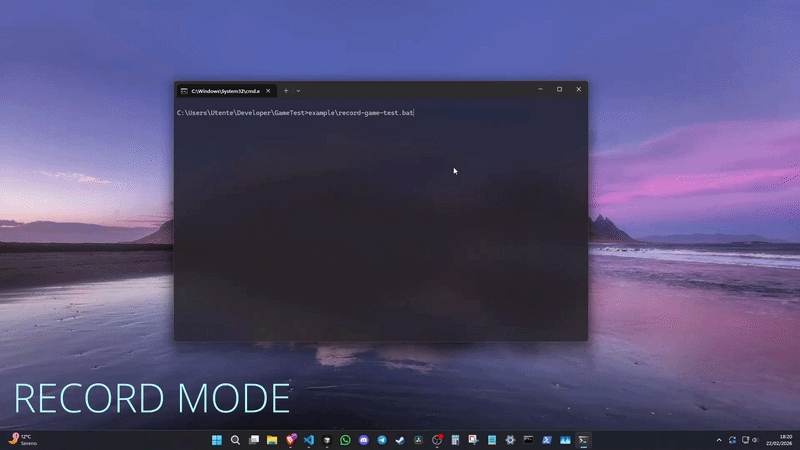

<p align="center">
  
</p>

<p align="center">
  A record/replay testing framework for games written in C.
</p>

<p align="center">
  
  
  
  
</p>

---

GameTest captures keyboard, mouse, and gamepad input during a recording session and injects that input back deterministically during replay, allowing automated regression testing of game logic without mocking or restructuring the game loop.



---

## Documentation

| Document | Description |
|---|---|
| [EXAMPLE.md](EXAMPLE.md) | Walkthrough of the bundled Snake game — initialization, seed pinning, sync signals, inline assertions, and score verification. |
| [HOW_IT_WORKS.md](HOW_IT_WORKS.md) | Record/replay lifecycle, input capture, Pin, Track, and SyncSignal. |
| [TOOL.md](TOOL.md) | `GameTest-Tool` CLI reference. |
| [DETAILS.md](DETAILS.md) | Hard limits, known edge cases, and the complete API reference. |

---

## Building

CMake 3.19 or later is required.

```sh
cmake -B build
cmake --build build
```

### CMake options

| Option | Default | Description |
|---|---|---|
| `GMT_BUILD_SHARED` | `OFF` | Build GameTest as a shared library instead of static. |
| `GMT_BUILD_EXAMPLE` | `ON` | Build the bundled example game (requires internet access; fetches GLFW 3.4). |
| `GMT_BUILD_TOOL` | `ON` | Build `GameTest-Tool`, the CLI runner. |

---

## Integration

Link the `GameTest` target and include `GameTest.h`.

```c
#include <GameTest.h>
```

Call `GMT_Init` once at startup, `GMT_Update` at the top of every frame, and `GMT_Quit` on shutdown:

```c
GMT_Setup setup = {0};
setup.mode      = mode;       // GMT_Mode_RECORD, GMT_Mode_REPLAY, or GMT_Mode_DISABLED
setup.test_path = test_path;  // path to the .gmt file
GMT_Init(&setup);

while (running) {
    GMT_Update();    // must be first, before any input polling
    PollInput();
    UpdateGame(dt);
    Render();
}

GMT_PrintReport();
GMT_Quit();
```

Parse the mode and path from command-line arguments rather than hard-coding them:

```c
char path[512];
GMT_Mode mode;
GMT_ParseTestFilePath((const char**)argv, argc, path, sizeof(path));
GMT_ParseTestMode((const char**)argv, argc, &mode);
```

The framework accepts `--test=<path>` and `--test-mode=record|replay|disabled`. These are the arguments that `GameTest-Tool` passes automatically when it launches your game.

### Disabling at compile time

Define `GMT_DISABLE` before including the header to turn every macro into a no-op. No object code is generated and no runtime overhead is incurred.

---

## License

MIT. Copyright (c) 2026 Christian Luppi.
